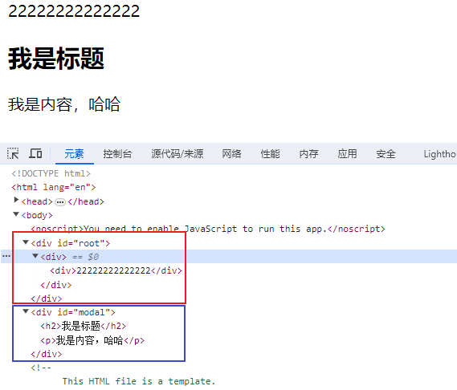
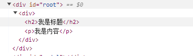
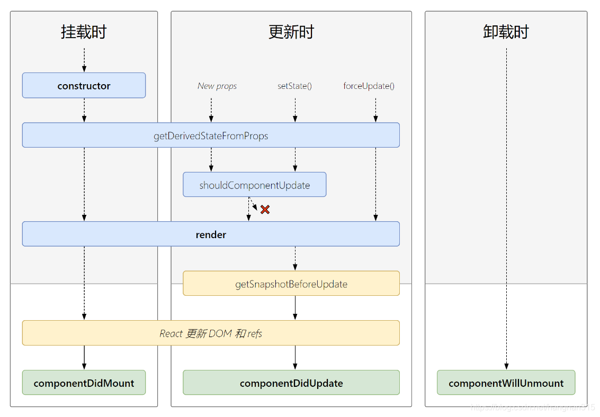

---
prev:
  text: 'Vue基础入门'
  link: '/note/Vue/'
next:
  text: 'Uni-App基础入门'
  link: '/note/Uni-App/'
---

# React 入门笔记

## 1.什么是 React

React 是一个用于构建用户界面的 JavaScript 库，主要用于构建 UI，而不是一个 MVC 框架，但可以使用 React 作为 MVC 架构的 View 层轻易的在已有项目中使用，它是一个用于构建用户界面的 JavaScript 库，起源于 Facebook 的内部项目，用来架设 Instagram 的网站，于 2013 年 5 月开源。
React 是用于动态构建用户界面的 JavaScript 库(只关注于视图)。React 拥有较高的性能，代码逻辑非常简单，越来越多的人已开始关注和使用它。

## 2.React 工作原理

1. React 在内存中创建一个虚拟 DOM。
2. React 不是直接操作浏览器的 DOM，而是在内存中创建一个虚拟 DOM，在对浏览器 DOM 进行更改之前，它会在其中执行所有必要的操作。
3. React 只改变需要改变的地方！
4. React 找出已经进行了哪些更改，并只更改需要更改的内容。

## 3.React 的特点

1. React 速度快（虚拟 DOM）
   与其他框架相比，React 采用了独特操作 DOM 的方式。
   它并不直接对 DOM 进行操作，它引入了一个虚拟 DOM 的概念，安插在 JavaScript 逻辑和实际的 DOM 之间，这一概念提高了 WEB 性能，我们所谓的 DOM 树其实就是一个树状结构嵌套的 JavaScript 对象。而在浏览器中，DOM 树的改动会造成浏览器一系列的计算，因此我们可以基于现有的 DOM 树结构，克隆出一份一模一样的 DOM 树，即“虚拟 DOM ”，将所有的改动都实现在这棵虚拟 DOM 上，然后统一合并至浏览器中的 DOM 树中以解决之前所提到的性能瓶颈。
2. 跨浏览器兼容
   虚拟 DOM 帮助我们解决了跨浏览器问题，它为我们提供了标准化的 API，甚至在 IE8 中都是没问题的
3. 组件化
   为程序编写独立的模块化 UI 组件，并且它们可以引入其他组件。这等同于提高了代码的可维护性。
4. 单向数据流
   在 React 中，数据的组织形式是树状的，由上至下单向流动（对应 DOM 树），之所以这样设计，是因为：数据流更清晰，组件的状态就更可控；
5. 纯粹的 JavaScript 语法
   我们很容易就忽视 React 的这一特点，即在 React 中，没有任何特殊的专有的 React 语法需要理解和记忆，所有的组件，数据操作，业务逻辑都是通过使用 JavaScript 语法实现的。

## 4.React 高效的原因

1. 使用虚拟 (virtual)DOM, 不总是直接操作页面真实 DOM。
2. DOM Diffing 算法, 最小化页面重绘。

## 5.React 官方网站

1. [英文官网: https://reactjs.org/](https://reactjs.org/)
2. [中文官网: https://react.docschina.org/](https://react.docschina.org/)

## React 基本使用

**创建和启动 React 项目**

（1）创建一个项目

```sh
npx create-react-app  项目名称
```

（2）进入项目文件

```bash
cd test
```

（3）启动项目

```sql
npm start
```

### 1.类组件和函数式组件

1.类组件

- 类组件是使用 ES6 class 语法定义的 React 组件。
- 它可以包含状态(state)和生命周期方法，允许在组件内部管理状态和处理生命周期事件。
- 适用于复杂的逻辑和状态管理，以及需要使用生命周期方法的场景。

```sh
import React from 'react'
// 1.类组件
class App extends React.Component {
  constructor() {
    super()
    this.state = {
      message: 'HELLO React',
    }
  }
  render() {
    const { message } = this.state
    return <h2>{message}</h2>
  }
}
export default App
```

2.函数式组件

- 函数式组件是使用函数来定义的 React 组件。
- 它通常不包含状态和生命周期方法，但可以使用 React Hooks 来管理状态和处理副作用。
- 适用于简单的 UI 展示和逻辑处理，以及需要更简洁的代码结构的场景。

```sh
// 函数式组件
export default  function App() {
  return <h1>hallo React</h1>
}
```

区别：

- 类组件使用 class 语法，而函数式组件使用函数语法。
- 类组件有自己的状态和生命周期方法，而函数式组件通常使用 Hooks 来管理状态和处理副作用。
- 类组件更灵活，适用于复杂的场景，而函数式组件更简洁，适用于简单的场景。

### 2.组件通讯

#### 1.props 组件通讯

**父传子**

```sh
 // 父组件
 render() {
    const { name, age, banner } = this.state
    return (
      <h2>
        <HelloWorld
          name={name}
          age={age}
          banner={banner}
          title='轮播图'
          message={{ class: '6年级', whichclass: '3班' }}
        />
      </h2>
    )
  }
  // 子组件
 render() {
    const { age, name, message, banner, title } = this.props
    return (
      <div>
        <div>{title}</div>
        <h2>姓名：{name}</h2>
        <h2>年龄：{age}</h2>
        <h2>
          我今年读{message.class}
          {message.whichclass}
        </h2>
        {banner.map((item) => {
          return <li key={item.acm}>{item.title}</li>
        })}
      </div>
    )
  }
```

**子传父**

```sh
// 子组件
export class AddCounter extends Component {
  add(item) {
    this.props.addclick(item)  // 子组件触发父组件的addclick函数
  }
  render() {
    return (
      <div>
        <button onClick={(e) => this.add(1)}>+1</button>
        <button onClick={(e) => this.add(5)}>+5</button>
        <button onClick={(e) => this.add(10)}>+10</button>
      </div>
    )
  }
}
export default AddCounter
----
//父组件
export class App extends Component {
  constructor() {
    super()
    this.state = {
      count: 100,
    }
  }
  change(count) {
    this.setState({ count: this.state.count + count })
  }
  render() {
    const { count } = this.state
    return (
      <div>
        <h2>当前数字：{count}</h2>
        <AddCounter addclick={(c) => this.change(c)} />
        <SubCounter SubClick={(c) => this.change(c)} />
      </div>
    )
  }
}
export default App
```

#### 2.Ref 组件通讯

**父传子**

```
//父组件
  constructor() {
      super();
      this.myRef = React.createRef(); // 创建Ref，并保存在实例属性myRef上
  }
  componentDidMount() {
      this.myRef.current.myFunc('湖北武汉');// 调用子组件的函数，传递一个参数
  }
  render() {
      return (
           <HelloWorld ref={this.myRef} />
      );
  }
  //子组件
  ---
 class HelloWorld extends React.Component {
  constructor() {
    super()
    this.state = {
      name:"admin"
    }
  }
  myFunc(city) {
    this.setState({
      address:city
    })
}
render() {
    return  <div>name:{this.state.name},address:{this.state.address}</div>
 }
}
```

**子向父**

```sh
// 父组件
class App extends React.Component {
  constructor(props) {
    super(props);
    this.childRef = React.createRef(); // 创建Ref，并保存在实例属性childRef上
  }
  handleClick = () => {
    const messageFromChild = this.childRef.current.getMessage(); // 通过ref调用子组件的方法
    console.log('Message', messageFromChild);
  };
  render() {
    return (
      <div>
        <HelloWorld ref={this.childRef} />
        <button onClick={this.handleClick}>Get Message from Child</button>
      </div>
    );
  }
}
---
//子组件
class HelloWorld extends React.Component {
  getMessage = () => {
    return 'Hello from Child';
  };
 render() {
    return  <div>Child Component</div>;
 }
}
```

#### 3.跨组件通信 Context

react 中数据是通过 props 属性自上而下（由父及子）进行传递的，但这种做法对于多层级父子关系的组件传值是极其繁琐的。react 提供了 context api 来实现在组件之间共享此类值的方式，而不必显式地通过组件树的逐层传递 props。React 16.3 之后的 contextapi 较之前的好用。

```sh
// 第一步.创建一个Context
import React from 'react'
export default ThemeContext = React.createContext()

//第二步.通过ThemeContext.Provider中的value 属性 为后代提供数据， 多个Provider可以进行嵌套
export class App extends Component {
  constructor() {
    super()
    this.state = {
      info: { name: '普京', age: '70' },
    }
  }
  render() {
    const { info } = this.state
    return (
      <div>
        <ThemeContext.Provider value={{ name: '奥八马', age: '50' }}>
          <Home {...info}></Home>
        </ThemeContext.Provider>
      </div>
    )
  }
}

// 第三步：设置组件contextType为某一个Context
import React, { Component } from 'react'
import ThemeContext from './context/theme-context'
export class Homeinfo extends Component {
  render() {
    // 第四步，获取数据，并且使用数据
    return (
      <div>
        我叫{this.context.name}今年{this.context.age}岁了
      </div>
    )
  }
}
//设置组件contextType为某一个Context
Homeinfo.contextType = ThemeContext
export default Homeinfo

// 函数式组件使用方法
function HomeBanner() {
  return (
    <div>
      <ThemeContext.Consumer>
        {(value) => {
          return (
            <h2>
              我叫{value.name},今年{value.age}岁了
            </h2>
          )
        }}
      </ThemeContext.Consumer>
    </div>
  )
}
export default HomeBanner
```

### 3.setState 的使用

**1.使用 setState 的原因**

开发中我们并不能直接通过修改 state 的值来让界面发生更新因为我们修改了 state 之后，希望 React 根据最新的 State 来重新渲染界面，但是 this.state 这种方式的修改 React 并不知道数据发生了变化, React 并没有实现类似于 Vue2 中的 Object.defineProperty 或者 Vue3 中的 Proxy 的方式来监听数据的变化(也就是说 React 并没有类似于 Vue 的数据劫持的)，我们必须通过 setState 来告知 React 数据已经发生了变化。

**2.setState 的使用**

```sh
// 1.setState的基本用法
     this.setState({
       message: '你好Tom',
     })
// 2.setState可以传入一个回调函数
    // 好处一：可以在回调函数中编写新的state的逻辑
    // 好处二：当前的回调函数会将之前的state 和props传递进来
     this.setState((state, props) => {
       console.log(state,props);
       return {
        message: '你好Tom',
      }
    })
// 3.setState在React的事件处理中是一个异步调用
// 如果希望在数据更新之后(数据合并)，获得对应的结果执行一些逻辑代码
    this.setState({
      message: '你好Tom',
    }, () => {
      console.log(this.state.message);
    })
  }
```

### 4.React.memo 和 React.PureComponent

1. **React.memo：**

- React.memo 是一个高阶组件，它可以用来包裹函数组件，并且在组件的 props 没有变化时，可以阻止不必要的重新渲染。
- React.memo 只能用于函数组件，不能用于类组件。
- 使用 React.memo 时，组件会对比前后两次渲染的 props，如果 props 没有变化，则不会重新渲染组件。
- 适用于函数组件的场景，可以帮助避免不必要的渲染。

示例：

```jsx
import React from 'react';

const MyComponent = React.memo((props) {
  // 组件的渲染逻辑
});
```

**2.React.PureComponent：**

- React.PureComponent 是 React 中的一个基类，它可以用于类组件，并且在组件的 state 和 props 没有变化时，可以阻止不必要的重新渲染。
- React.PureComponent 实现了一个浅比较（shallow comparison）来判断 props 和 state 是否发生变化，从而决定是否重新渲染组件。
- 适用于类组件的场景，可以帮助避免不必要的渲染。

示例：

```jsx
// 当执行render函数时，该函数类容都会进行重新渲染，哪怕子元素内容根本没有改变，这样非常浪费性能
// 后面有了PureComponent 就是对自己的代码进行比较 如果内容没有改变就不进行重新渲染
// 注意：使用PureComponent时，不建议直接修改this.state的值，而是应该通过setState来更新state的值。这是因为React.PureComponent实现了一个浅比较（shallow comparison）来判断props和state是否发生变化，从而决定是否重新渲染组件。
import React from 'react';
class MyComponent extends React.PureComponent {
  // 组件的渲染逻辑
}
```

### 5.React 高阶组件

> 高阶组件就是一个函数，且该函数接受一个组件作为参数，并返回一个新的组件

```jsx
import React from 'react';

// 定义一个高阶组件
function withLogger(WrappedComponent) {
  return class extends React.Component {
    componentDidMount() {
      console.log(`Component ${WrappedComponent.name} is mounted`);
    }

    render() {
      return <WrappedComponent {...this.props} />;
    }
  };
}

// 创建一个普通的React组件
class MyComponent extends React.Component {
  render() {
    return <div>Hello, I am a normal component</div>;
  }
}

// 使用高阶组件包裹普通组件
export default withLogger(MyComponent);

// 渲染增强后的组件
function App() {
  return (
    <div>
      <MyComponent />
    </div>
  );
}
```

### 6.Portals 的使用

Portal 提供了一种将子节点渲染到存在于父组件以外的 DOM 节点的优秀的方案：

```jsx
ReactDOM.createPortal(React元素，哪个容器)
```

```jsx
// 根节点
<div id="root"></div>
<div id="modal"></div>
---
import { createPortal } from 'react-dom'
export class Modal extends PureComponent {
  render() {
    return createPortal(this.props.children, document.querySelector('#modal'))
  }
}
---
export class App extends PureComponent {
  render() {
    return (
      <div>
        <div>22222222222222</div>
        <Modal>
          <h2>我是标题</h2>
          <p>我是内容，哈哈</p>
        </Modal>
      </div>
    )
  }
}
```



### 7.Fragment 的用法

每次我们写结构都要包一个根 div，并且这个 div 会在浏览器元素中显示



```html
// 如果一个组件不想外层多一个div包着就用这玩意包裹一下
<Fragment>
  <h2>我是标题</h2>
  <p>我是内容</p>
</Fragment>
```

### 8.受控组件和非受控组件

**受控组件**

React 受控组件是一种由 React 状态控制的组件。在受控组件中，组件的值由 React 状态管理。React 状态是一个存储组件数据的 JavaScript 对象，可以随时更新。当组件的值发生变化时，React 状态将更新，组件将重新渲染以反映新值。

例如，下面是一个简单的受控组件，它是一个文本框，它的值由 React 状态管理：

```jsx
class ControlledInput extends React.Component {
  constructor(props) {
    super(props);
    this.state = { value: '' };
  }

  handleChange(event) {
    this.setState({ value: event.target.value });
  }

  render() {
    return (
      <input
        type="text"
        value={this.state.value}
        onChange={(e) => this.handleChange(e)}
      />
    );
  }
}
```

在上面的代码中，我们创建了一个受控组件 ControlledInput。该组件包含一个文本框，它的值由 React 状态 value 管理。我们还定义了一个 handleChange 函数，它在文本框的值发生变化时被调用，并更新 React 状态 value。最后，我们在文本框的 value 属性中绑定了 React 状态 value，这意味着文本框的值将始终与 React 状态 value 保持同步。

**非受控组件**

React 非受控组件是一种不由 React 状态控制的组件。在非受控组件中，组件的值不由 React 状态管理。相反，组件的值由 DOM 节点直接管理。

例如，下面是一个简单的非受控组件，它是一个文本框，它的值不由 React 状态管理：

```jsx
class UncontrolledInput extends React.Component {
  constructor(props) {
    super(props);
    this.inputRef = React.createRef();
  }

  handleClick() {
    console.log('Input value:', this.inputRef.current.value);
  }

  render() {
    return (
      <div>
        <input type="text" ref={this.inputRef} />
        <button onClick={() => this.handleClick()}>Click me</button>
      </div>
    );
  }
}
```

在上面的代码中，我们创建了一个非受控组件`UncontrolledInput`。该组件包含一个文本框，它的值不由 React 状态管理。相反，我们使用`React.createRef()`方法创建了一个名为`inputRef`的引用。然后，我们将该引用传递给文本框的`ref`属性，这意味着我们可以使用`inputRef.current.value`获取文本框的当前值。最后，我们定义了一个`handleClick`函数，它在点击按钮时被调用，并输出文本框的值。

**区别**

- React 受控组件和非受控组件之间的最大区别是组件的值是由 React 状态控制还是由 DOM 节点控制。
- 在受控组件中，组件的值由 React 状态控制。这意味着当组件的值发生变化时，React 状态将更新，组件将重新渲染以反映新值。另外，您可以使用 React 状态控制组件的值进行验证和处理。
- 在非受控组件中，组件的值由 DOM 节点控制。这意味着当组件的值发生变化时，它将直接反映在 DOM 节点上，而不会更新 React 状态。这使得非受控组件可以更快地更新，但也使得验证和处理组件的值更加困难。

**受控组件和非受控组件的优缺点**

- 容易进行验证和处理：由于组件的值由 React 状态控制，因此您可以轻松地验证和处理组件的值。例如，您可以使用`onChange`事件来验证组件的值是否满足特定的条件，并更新 React 状态以反映验证结果。

- 有更好的可预测性：由于组件的值由 React 状态控制，因此组件的行为更容易预测。例如，当组件的值发生变化时，它将始终更新 React 状态并重新渲染，这使得应用程序更加可预测。

**受控组件的缺点**
更多的代码：由于组件的值由 React 状态控制，因此需要编写更多的代码来管理组件的值。这可能会导致代码更难以维护和理解。

性能问题：由于每次组件的值发生变化时，它都会更新 React 状态并重新渲染，这可能会影响性能。如果您在处理大量数据时使用受控组件，则可能会遇到性能问题。

**非受控组件的优点**
更快的更新：由于组件的值由 DOM 节点控制，因此非受控组件可以更快地更新。这使得非受控组件适用于需要高速更新的场景，例如实时搜索框。

更少的代码：由于组件的值不由 React 状态控制，因此需要编写更少的代码来管理组件的值。这使得代码更易于维护和理解。

**非受控组件的缺点**
难以进行验证和处理：由于组件的值不由 React 状态控制，因此难以对其进行验证和处理。例如，如果您需要确保组件的值满足特定条件，则必须使用 DOM 节点来验证组件的值，并且必须手动更新组件的值。

更少的可预测性：由于组件的值由 DOM 节点控制，因此组件的行为更难以预测。例如，当组件的值发生变化时，它不会更新 React 状态并重新渲染，这可能会导致应用程序的行为更加不可预测。

何时使用受控组件和非受控组件
React 受控组件和非受控组件都有各自的用途。以下是它们的主要应用场景：

**受控组件的应用场景**
当需要对组件的值进行验证和处理时，应使用受控组件。例如，当您需要确保文本框的值仅包含数字时，您可以使用受控组件来验证文本框的值，并更新 React 状态以反映验证结果。

当需要确保组件的值与应用程序的状态同步时，应使用受控组件。例如，当您需要确保文本框的值与应用程序的状态同步时，您可以使用受控组件来更新 React 状态，并确保组件的值与应用程序的状态同步。

**非受控组件的应用场景**
当需要高速更新组件的值时，应使用非受控组件。例如，当您需要实现实时搜索框时，您可以使用非受控组件来快速更新文本框的值，并更新搜索结果。

当组件的值不需要与应用程序的状态同步时，应使用非受控组件。例如，当您需要实现一个单选按钮组时，您可以使用非受控组件来更新单选按钮的值，并且不需要将其与应用程序的状态同步。

### 9.严格模式

React 严格模式是一种开发模式，它可以帮助开发者在开发过程中发现一些潜在的问题，并提供更好的错误提示。要在 React 应用中启用严格模式，可以在应用的根组件中添加`<React.StrictMode>`标签。

严格模式下，React 会进行一些额外的检查和警告，包括：

1. 检测过时的生命周期方法
2. 检测过时的 API 使用
3. 检测不安全的生命周期方法
4. 检测意外的副作用

启用严格模式可以帮助开发者在开发过程中更早地发现潜在的问题，并且能够提供更好的错误提示，帮助开发者更好地理解和修复问题。

## React 路由

**核心组件**
**1.BrowerRouter**
作用：包裹整个应用，一个 React 应用只需要使用一次

两种常用 Router : HashRouter 和 BrowserRouter

**2.HashRouter**
使用 URL 的哈希值实现 localhost:3000/#/first

BrowserRouter ( 推荐 )

使用 H5 的 history.pushState API 实现 localhost:3000/first

### 第一步：安装

react-router-dom 是浏览器端的基于 react-router 库的库，所以装了这个以后就不用再手动装 react-router 了

```bash
npm install react-router-dom
```

### 第二步：连接路由

连接你的 App 到浏览器的 URL。用 BrowserRouter 包裹在你的 App 的外面

```jsx
// main.jsx
import { BrowserRouter } from 'react-router-dom';

const root = ReactDOM.createRoot(document.getElementById('root'));
root.render(
  <BrowserRouter>
    <App />
  </BrowserRouter>,
);
```

### 第三步：路由表配置

```jsx
//路由表配置：src/routes/index.jsx
import { Navigate } from 'react-router-dom';

import Home from '../views/Home';
import Friend from '../views/Friend';
import Setting from '../views/Setting';
import NotFound from '../views/NotFound';
import Chat from '../views/Chat';

const routes = [
  // Navigate 重定向
  { path: '/', element: <Navigate to="/home" /> },
  { path: '/home', element: <Home /> },
  {
    path: '/friend',
    element: <Friend />,
    children: [{ path: 'chat/:name', element: <Chat /> }],
  },
  { path: '/setting', element: <Setting /> },
  { path: '*', element: <NotFound /> },
];
export default routes;
```

### 路由跳转

路由配置好后免不了要进行页面跳转，但新版的 react-router 移除了 history 对象，故不能使用 v5 版本的 history（包括`useHistory` hook）已不能使用，我们可以使用以下两中方式进行跳转

- 使用`<Link>`或`<NavLink>`进行跳转 这种方式与上一个版本几乎没有太大的区别，唯一的区别是`<NavLink>`组件的高亮写法发生了变化（使用`style`或`className`**回调函数**的方式实现高亮，用法如下）

**点击跳转**

```jsx
<Link to="/home">首页</Link>
<Link to="/about">关于</Link>
<Link to="/login">登录</Link>

<NavLink to="/home" style={({isActive})=>(isActive?{color:'#f00'}:{})}>首页</NavLink>
<NavLink to="/home" className={({isActive})=>isActive?'current':''}>首页</NavLink>
```

**编程式导航**

使用`useNavigate()`进行跳转 有时候我们并不能使用以上两个组件进行跳转，如根据 ajax 请求返回值跳转不同的页面，这时我们就得使用 js 的方式时行跳转了，虽然新版的 react-router 已经移除掉 history 对象，但给我们提供了 `useNavigate()` hook 实现路由跳转，使用方法如下

```jsx
import {  useNavigate } from "react-router-dom";
export default function Demo() {
  const navigate = useNavigate();
  //...
}
// 1.push跳转+携带params参数
navigate(`/child/${id}/${title}`);
// 2.push跳转+携带search参数
navigate(`/child?id=${id}&title=${title}`);
// 3.push跳转+携带state参数
navigate("/child", { state: { id, title }});
---
// 1.replace跳转+携带params参数
navigate(`/child/${id}/${title}`,{replace: true});
// 2.replace跳转+携带search参数
navigate(`/b/child?id=${id}&title=${title}`,{replace: true});
// 3.replace跳转+携带state参数
navigate("/child", { state: { id, title },replace: true});
```

### 路由传参

我们都知道，在进行路由跳转时，可以通过附带一些参数一起传递到目标页面来实现某些特殊功能，但新版的 react-router 已经从 props 中移除了`history`、`location`、`match`，也移除掉了`withRouter`高阶组件，所以无法使用老版本的方式传参与接收，新版用法如下

- **search 传参**

```jsx
let navigate = useNavigate();
navigate(`/home?page=1&size=10`);
navigate({
  pathname: '/home',
  search: 'page=1&size=10',
});
```

在对应组件接收参数也很简单，使用`useSearchParams` hook 进行接收，得到 URLSearchParams 对象以及设置 search 参数函数组成的数据

```jsx
function Home() {
  const [searchParams, setSearchParams] = useSearchParams();
  searchParams.get('page'); //1
  searchParams.get('size'); //10
  return <div>首页</div>;
}
```

- **动态路由传参**

```jsx
<Route path="/user" element={<User />}>
  <Route path=":/id" element={<UserDetail />} />
</Route>
```

配置完以上路由后，当页面跳转到`/user/123`这个路径时，可以在`<UserDetail/>`组件中使用`useParams` hook 获取`123`这个 id

```jsx
function UserDetail() {
  const { id } = useParams();
  return <div>id:{id}</div>;
}
```

- **state 传参 通过`<Link/>`、`<NavLink/>`或 `useNavigate`进行跳转时，都可以传递 state 参数，用法如下:**

```
    <Link to="/home" state={{idx:1,key:'qf'}}>首页</Link>
    navigate('/home',{state:{idx:1,key:'qf'}})
```

在首页组件中通过`useLocation` hook 获取 state 值

```jsx
function Home() {
  const { state } = useLocation();
  state.idx;
  state.key;
  return <div>首页</div>;
}
```

### 路由懒加载

- React 利用 React.lazy 与 import()实现了渲染时的动态加载
- 利用 Suspense 来处理异步加载资源时页面应该如何显示的问题
- 通过 lazy() api 来动态 import 需要懒加载的组件
- import 的组件目前只支持 export default 的形式导出
- Suspense 来包裹懒加载的组件进行加载，可以设置 fallback 现实加载中效果
- React.lazy 可以结合 Router 来对模块进行懒加载。

`React.suspense`用来实现懒加载路由时的 loading 兜底

```jsx
<Suspense fallback={<Loading />}>
  <App />
</Suspense>
```

- fallback 参数中可以传入 react 组件或 dom 元素，例如：<div>Loading...</div>

- 注意：React.suspense 不只是针对于懒加载的路由，而针对所有懒加载的组件，只要是存在懒加载的，都可以通过在外成包裹 React.suspense 来实现 loading 或其他占位 dom
  React.lazy 用来包装组件路径，实现路由懒加载

- `React.lazy`用来包装组件路径，实现路由懒加载

  ```jsx
  const Home = React.lazy(() => import('../pages/Home'));
  const Login = React.lazy(() => import('../pages/Login'));
  ```

## React 生命周期



React 的生命周期有三个阶段：挂载阶段(Mounting) ，更新阶段（Updating）和卸载阶段（Unmounting）个阶段都有不同的生命周期方法，用于在不同的时机执行特定的操作。

### 挂载阶段

当组件实例被创建并插入 DOM 时，其生命周期调用顺序如下

#### 1.constructor

组件实例化时调用，用于初始化状态和绑定方法。

#### 2.static getDerivedStateFromProps

在组件实例化和接收新的 props 时调用，用于根据新的 props 更新状态。

#### 3.render

根据组件的 props 和 state 返回 JSX 元素。

#### 4.componentDidMount

在组件挂载到 DOM 后调用，可以进行异步操作、订阅事件等

### 组件更新时

当组件的 props 或 state 发生变化时会触发更新。组件更新的生命周期调用顺序如下

#### 1.static getDerivedStateFromProps()

在接收新的 props 时调用，用于根据新的 props 更新状态。

#### 2.shouldComponentUpdate()

决定组件是否需要重新渲染，默认返回 true。可以通过比较新旧 props 和 state 来优化性能。

#### 3.render()

根据组件的 props 和 state 返回 JSX 元素。

#### 4.getSnapshotBeforeUpdate()

在 React 更新 DOM 之前回调的一个函数，可以获取 DOM 更新前的一些信息（比如说滚动位置）

#### 5.componentDidUpdate()

组件更新后立即调用，首次渲染不会调用

### 卸载阶段

#### componentWillUnmount

组件即将从 DOM 中卸载前调用，可以进行清理操作，如取消订阅、清除定时器等。

## Hooks

### 简介

Hooks，可以翻译成钩子。

在类组件中钩子函数就是生命周期函数，Hooks 主要用在函数组件。

在 react 中定义组件有 2 种方式：class 定义的类组件和 function 定义的函数组件。

在类组件中，钩子函数可以给组件增加额外的功能。

类组件的不足：

在一个钩子里可能有很多业务代码。
一个业务很可能出现在多个钩子里。
class 组件中的 this 指向问题
在函数组件中，函数在执行完毕之后，会自动销毁内存，存储在函数中的状态无法保留。为了增加函数组件的功能，我们需要引入 Hooks。

类组件通过在构造器中直接使用 this.state = {} 给组件设置状态值，而函数组件不行。因为函数执行完后会销毁内容，在函数内声明的变量就会自定销毁，所以函数组件无法设置状态，于是 react 提供了 Hooks。

### 1.useState

1. useState 向组件引入新的状态，这个状态会被保留在 react 中。
2. useState 只有一个参数，这个参数是初始状态值，它可以是任意类型。
3. useState 可以多次调用，意味着可以为组件传入多个状态。
4. useState 返回值是一个数组，第一个元素就是我们定义的 state，第二个元素就是修改这个 state 的方法。接收 useState 的返回值使用数组结构语法，我们可以随意为 state 起名字。修改 state 的方法必须是 set + 状态名首字母大写构成，不按照约定写就会报错。
5. useState 的参数也可以是一个函数，这个函数的返回值就是我们的初始状态。

```jsx
import { memo, useState } from 'react';
// 普通函数不能使用hook，除非是use开头
// 在自定义hooks中，可以使用react提供的其他hooks：必须使用use开头，
function useWang() {
  const [message] = useState('Hello');
  return message;
}

function CounterHook(props) {
  //useState是一个函数里面只有一个值不设置就是undefined
  //返回的是一个数组 第一个参数是当前状态的值第二个参数设置状态值的参数
  const [counter, setcounter] = useState(0);
  const message = useWang();
  return (
    <div>
      <h2>当前计数：{counter}</h2>
      <button onClick={(e) => setcounter(counter + 1)}>+1</button>
      <button onClick={(e) => setcounter(counter - 1)}>-1</button>
    </div>
  );
}
export default memo(CounterHook);
```

### 2.useEffect

useEffect 这个 Hook 函数的主要作用就是将副作用代码添加到函数组件内。所谓的副作用代码就是 dom 更改、计时器、数据请求等。

使用场景：

useEffect(() => {}) 这种写法代表两个生命周期函数 componentDidMount 和 componentDidUpdate。
useEffect(() => {}, []) 这种写法代表生命周期函数 componentDidMount。
useEffect(() => () => {}) 这种写法代表组件卸载之前 componentWillUnmount 和 componentDidUpdate 两个生命周期函数。

1. 无依赖数组：`useEffect(callback)` 这种写法表示这个 effect 在每次组件更新时都会执行。无论组件的 props 或 state 是否发生变化，都会触发这个 effect。这种写法通常用于需要在组件更新时执行的副作用操作，比如数据获取、订阅等。
2. 空依赖数组：`useEffect(callback, [])` 传入空数组作为`useEffect`的第二个参数表示这个 effect 不依赖于任何 props 或 state。这意味着这个 effect 只会在组件挂载后执行一次，类似于类组件中的`componentDidMount`生命周期钩子。这种写法通常用于只需要在组件挂载后执行一次的副作用操作。
3. 有依赖数组：`useEffect(callback, [dep1, dep2, ...])` 如果你传入一个非空数组作为`useEffect`的第二个参数，这表示这个 effect 依赖于数组中的变量。当数组中的任何一个变量发生变化时，都会触发这个 effect。这种写法通常用于需要根据特定的 props 或 state 变化执行副作用操作的情况。
4. 返回清除函数：`useEffect(() => { return () => { /* 清除操作 */ }，[]})` 如果在`useEffect`的回调函数中返回了一个函数，那么这个函数会在组件卸载或者下一次 effect 执行前执行，用于清除之前的副作用操作。这种写法适用于需要进行清除操作的副作用，比如订阅、定时器等。

### 3.useContext

在 Hooks 之前，react 开发者都是使用 class 组件进行开发，父子组件之间通过 props 传值。但是现在开始使用方法组件开发，没有 constructor 构造函数，也就没有了 props 的接收，所以父子组件的传值就成了一个问题，于是就有了 useContext。

**useContext 基本使用可以分为固定的三步**

1.根组件导入并调用 createContext 方法，得到 Context 对象，并导出

```jsx
import { createContext } from 'react';
export const Context = createContext();
```

2.在根组件中使用 **Provider** 组件**包裹需要接收数据的后代组件**，并通过 **value** 属性提供要共享的数据

```jsx
return (
  <Context.Provider value={ 这里放要传递的数据 }>
  	需要接收数据的后代组件
  </Provider>
)
```

3.需要获取公共数据的后代组件：导入 useContext,并按需导入根组件中导出的 Context 对象；调用 useContext(第一步中导出的 Context) 得到 value 的值

```jsx
import React, { useContext } from 'react';
import { Context } from './index';
const 函数组件 = () => {
  const 公共数据 = useContext(Context); // 这里的公共数据就是根组件value的值
  return 函数组件的内容;
};
```

### 4.useCallback

在 React 开发中，性能优化一直是一个非常重要的话题。其中，防止不必要的渲染和函数对象的重复创建也是开发者需要关注的方面。而 useCallback 就是 React 提供的一个 Hook 函数，用来缓存回调函数，避免重复定义和重新渲染。它接受两个参数：回调函数和依赖数组。当依赖数组中的任何一个值发生变化时，useCallback 将会返回一个新的回调函数，否则将会返回之前缓存的回调函数。这样可以避免在每次渲染时都重新生成回调函数，从而提高组件的性能。

```jsx
const memoizedCallback = useCallback(() => {
  // 回调函数的逻辑
}, [依赖项]);
```

在这个例子中，memoizedCallback 是一个缓存的回调函数，它只在依赖项发生改变时才会重新创建。依赖项是一个数组，当数组中的任何一个值发生改变时，memoizedCallback 会重新创建。

### 5.useMemo

当你需要对计算昂贵的值进行缓存，以便在依赖项没有改变时避免重复计算时，React 的 useMemo hook 非常有用。它可以用来缓存一个值，以便在依赖项没有改变时，避免值的重新计算。

```jsx
//父组件
function App() {
  const [name, setName] = useState('名称');
  const [content, setContent] = useState('内容');
  return (
    <>
      <button onClick={() => setName(new Date().getTime())}>name</button>
      <button onClick={() => setContent(new Date().getTime())}>content</button>
      <Button name={name}>{content}</Button>
    </>
  );
}
//子组件
function Button({ name, children }) {
  function changeName(name) {
    return name + '改变name的方法';
  }
  const otherName = changeName(name);
  return (
    <>
      <div>{otherName}</div>
      <div>{children}</div>
    </>
  );
}
```

当我们点击父组件的按钮的时候，子组件的 name 和 children 都会发生变化。不管我们是改变 name 或者 content 的值，我们发现 changeName 的方法都会被调用。是不是意味着 我们本来只想修改 content 的值，但是由于 name 并没有发生变化，所以无需执行对应的 changeName 方法。但是发现他却执行了。 这是不是就意味着性能的损耗，做了无用功。

下面我们使用 useMemo 进行优化

```jsx
优化之后的子组件;
function Button({ name, children }) {
  function changeName(name) {
    console.log('11');
    return name + '改变name的方法';
  }
  const otherName = useMemo(() => changeName(name), [name]);
  return (
    <>
      <div>{otherName}</div>
      <div>{children}</div>
    </>
  );
}
```

这个时候我们点击 改变 content 值的按钮，发现 changeName 并没有被调用。但是点击改变 name 值按钮的时候，changeName 被调用了。我们可以`使用useMemo方法 避免无用方法的调用`，当然一般我们 changName 里面可能会使用 useState 来改变 state 的值，那就避免了组件的二次渲染。达到了优化性能的目的

### 6.useRef

在 react 中，我们可以使用 ref 来获取组件示例或者 DOM 元素。
一般使用方法：

```jsx
const App = memo(() => {
  const title = useRef();
  const inputREF = useRef();
  function showtitle() {
    console.dir(title.current);
    inputREF.current.focus(); //点击输入框直接获取焦点
  }
  return (
    <div>
      <h2 ref={title}>Hello World</h2>
      <input type="text" ref={inputREF} />
      <button onClick={showtitle}>查看title的DOM</button>
    </div>
  );
});
```

注意：

1. useRef 返回一个可变的 ref 对象，该对象只有个 current 属性，初始值为传入的参数( initialValue )；
2. 返回的 ref 对象在组件的整个生命周期内保持不变，除非手动修改；
3. 当更新 current 值时并不会 re-render ，这是与 useState 不同的地方；
4. useRef 也可以用来区分初始渲染还是更新(通过 current 有没值)；

### 7.useLayoutEffect

- 其函数签名与 `useEffect` 相同，只是调用时机不同。

- `useEffect`： 会在浏览器渲染绘制结束后执行

- `useLayoutEffect`： 则是在 DOM 更新完成后，浏览器绘制之前执行。
  在`react`完成`DOM`更新后马上**同步**调用的代码，所以会阻塞页面渲染。
- 官方建议优先使用`useEffect`

- 注意事项：

```html
如果你使用服务端渲染： 请记住，无论 useLayoutEffect() 还是 useEffect() 都无法在
Javascript 代码加载完成之前执行。 这就是为什么在服务端渲染组件中引入
useLayoutEffect() 代码时会触发 React 告警。 解决这个问题，需要将代码逻辑移至
useEffect() 中（如果首次渲染不需要这段逻辑的情况下），
或是将该组件延迟到客户端渲染完成后再显示（如果直到 useLayoutEffect() 执行之前
HTML 都显示错乱的情况下）
```

- 解决方法：

```
若要从服务端渲染的 HTML 中排除依赖布局 effect 的组件，
可以通过使用 showChild && <Child /> 进行条件渲染，
并使用 useEffect(() => { setShowChild(true); }, []) 延迟展示组件。
这样，在客户端渲染完成之前，UI 就不会像之前那样显示错乱了。
```

- 使用：

```jsx
import React, { useLayoutEffect } from 'react';
function MyComponent() {
  useLayoutEffect(() => {
    console.log('useLayoutEffect executed');
  }, []);
  return <div>My Component</div>;
}
```

### 8.自定义 Hooks

自定义 Hooks 是一种用来封装可重用逻辑的方式，它是一个函数，名称以 “use” 开头，函数内部可以使用其他的 Hooks。通过自定义 Hooks，您可以将组件逻辑提取到可重用的函数中，使得逻辑的复用变得更加容易。

```jsx
import { useState, useEffect } from 'react';

function useWindowWidth() {
  const [width, setWidth] = useState(window.innerWidth);
  useEffect(() => {
    const handleResize = () => {
      setWidth(window.innerWidth);
    };
    window.addEventListener('resize', handleResize);
    return () => {
      window.removeEventListener('resize', handleResize);
    };
  }, []);
  return width;
}

// 使用自定义 Hook 也非常简单，只需要在组件中调用即可：
import React from 'react';
import useWindowWidth from './useWindowWidth';
function MyComponent() {
  const width = useWindowWidth();
  return <div>Window width is: {width}</div>;
}
```

名为 `useWindowWidth` 的自定义 Hook。这个 Hook 使用了 `useState` 来存储窗口宽度的状态，并使用了 `useEffect` 来监听窗口大小的变化。通过这个自定义 Hook，我们可以在任何组件中获取窗口宽度，而不需要重复编写监听窗口大小变化的逻辑。

### 9.redux 中的 hooks

`useDispatch` 和 `useSelector` 是 React-Redux 库中提供的两个 Hooks，用于在函数式组件中访问 Redux 中的状态和派发 action。

1. `useDispatch`： `useDispatch` 是用于在函数式组件中派发 action 的 Hook。它返回一个 dispatch 函数，可以用来派发 Redux 中的 action。使用 `useDispatch` 可以避免在组件中引入 `connect` 高阶组件，使得派发 action 的逻辑更加简洁和直观。

例如：

```jsx
import { useDispatch } from 'react-redux';
function MyComponent() {
  const dispatch = useDispatch();
  const handleButtonClick = () => {
    dispatch({ type: 'INCREMENT' });
  };
  return <button onClick={handleButtonClick}>Increment</button>;
}
```

2. `useSelector`： `useSelector` 是用于在函数式组件中获取 Redux 中的状态的 Hook。它接收一个选择器函数作为参数，并返回选择器函数所计算出的状态。使用 `useSelector` 可以让我们在函数式组件中直接访问 Redux 中的状态，而不需要通过 `connect` 高阶组件来进行状态的映射。

例如

```jsx
import { useSelector } from 'react-redux';

function MyComponent() {
  const count = useSelector((state) => state.counter.count);
  return <div>Count: {count}</div>;
}
```

### 10.useID 的使用

有时需要为元素生成唯一的 ID。这种情况经常出现在表单元素、标签和用于无障碍性的目的上。React 提供了一个名为`useId`的自定义 Hook，它可以帮助我们生成唯一的 ID。

```jsx
import { useId } from 'react';
function MyComponent() {
  const uniqueId = useId();
  return (
    <div>
      <label htmlFor={uniqueId}>Input:</label>
      <input type="text" id={uniqueId} />
    </div>
  );
}
```

**如果您想要为生成的 ID 添加前缀，可以在 `useId` 中传入一个字符串作为参数。例如：**

```jsx
const uniqueId = useId('my-prefix');
```

### 11.useDeferredValue

`useDeferredValue` 是 React 的 Concurrent Mode 中引入的一个新的 Hook，它用于延迟更新某个值，以优化性能并提高用户体验。使用 `useDeferredValue` 可以让我们控制某个值的更新时机，从而避免不必要的渲染。

下面是一个简单的示例，演示了如何使用 `useDeferredValue`：

```jsx
import React, { useState, useDeferredValue } from 'react';

function MyComponent() {
  const [text, setText] = useState('');
  const deferredText = useDeferredValue(text, { timeoutMs: 2000 });

  return (
    <div>
      <input
        type="text"
        value={text}
        onChange={(e) => setText(e.target.value)}
      />
      <p>Deferred Value: {deferredText}</p>
    </div>
  );
}
```

在上面的示例中，我们使用 `useDeferredValue` 来创建了 `deferredText` 值。当 `text` 发生变化时，`deferredText` 会延迟更新 2000 毫秒。这意味着在这段时间内，`deferredText` 的值不会立即更新，从而可以避免不必要的渲染。

## Redux

#### **介绍**

1. redux 是一个专门用于做`状态管理`的 JS 库`(不是react插件库)`。
2. 它可以用在`react, angular, vue`等项目中, 但`基本与react配合使用`。
3. 作用: 集中式管理 react 应用中`多个组件共享的状态`。

#### **什么情况下需要使用 redux**

1. 某个组件的状态，需要让其他组件可以`随时拿到（共享）`。
2. 一个组件需要改变另一个组件的状态（`通信`）。
3. 总体原则：`能不用就不用`, 如果不用`比较吃力才考虑使用`。

#### redux 的三个核心概念

**1，action**
action 理解为动作，action 的值一般为一个对象，格式如 { type: "", data: "" }，type 是必须要的，因为 reducer 处理数据的时候要根据不同的 type 来进行不同的操作。
**2，reducer** 1.用于初始化状态、加工状态。  
 2.加工时，根据旧的 state 和 action， 产生新的 state 的纯函数。
**3，store**

store 是一个仓库，用来存储数据，它可以获取数据，也可以派发数据，还能监听到数据的变化。在 redux 中，只有一个 store，所有的需要管理的数据都保存在这个 store 里面，但是不能直接改变 store，需要通过返回的一个新 store 更改它

**store.getState() _拿到 store 中保存的数据_**

**store.dispatch()派发 action 修改内容**

**subscribe(listener): 注册监听, 当产生了新的 state 时, 自动调用**

#### redux 的核心 API

**1，createstore()**

作用：创建包含指定 reducer 的 store 对象

**2，store 对象**

1. 作用: redux 库最核心的管理对象
2. 它内部维护着: state 和 reducer
3. 核心方法:getState() dispatch(action) subscribe(listener)

**3，applyMiddleware()**

作用：应用上基于 redux 的中间件(插件库)

**4，combineReducers()**

作用：合并多个 reducer 函数

```jsx
import { createStore, applyMiddleware, compose, combineReducers } from 'redux';
import counterReducer from './counter/reducer';
import homeReducer from './home/reducer';
const reducer = combineReducers({
  counter: counterReducer,
  home: homeReducer,
});
```

### 使用

**1.安装**

```sh
npm install redux react-redux
```

**2.src 路径下，新建 store 文件**

**3.新建 src / store / index.js**

```react
import { createStore } from 'redux'
const initiaState = {
  name: 'why',
  counter: 100,
}
// 定义reducer函数：纯函数
// 参数一：store中目前保存的state
// 参数二：本次需要更新的action(dispatch传入的action)
function reducer(state = initiaState, action) {
  switch (action.type) {
    case 'change_name':
      return { ...state, name: action.name }
    case 'change_counter':
      return { ...state, counter: state.counter + action.num }
    default:
      return state
  }
}
export const store = createStore(reducer)
//此时已经创建好store了，只需要引入store就可以派发action操作
```

4.创建 store 后，便可以在 React 组件中使用它。 在 src/index.js 中引入我们刚刚创建的 store , 通过 React-Redux 的 `<Provider>`将 `<App>` 包裹起来,并将 store 作为 prop 传入。

```jsx
import store from './store';
root.render(
  <Provider store={store}>
    <App />
  </Provider>,
);
```

##### 派发 action

```react
import { store } from './store'
const changeNameAction = (name) => {
  return {
    type: 'change_name',
    name
  }
}
//通过dispatch修改数据
store.dispatch(changeNameAction('科比'))
```

##### 订阅数据变化

```
const unsubscribe = store.subscribe(() => {
  console.log('订阅数据变化', store.getState())
})
unsubscribe() //取消订阅
```

## react-ToolKit

Redux 工具包，简称 RTK。RTK 可以帮助我们处理使用 Redux 过程中的重复性工作，简化 Redux 中的各种操作， [官方文档](https://cn.redux.js.org/introduction/getting-started)

### **使用**

**1.安装**

```jsx
# NPM
npm install @reduxjs/toolkit
# Yarn
yarn add @reduxjs/toolkit
```

**configureStore** 他的作用跟以前的 createStore 是一样的但是它集成了很多的东西。他有三个参数

```jsx
import { configureStore } from '@reduxjs/toolkit';
import counterReducer from '../counterSlice/index';
const store = configureStore(
  //reducer: 将slice中的reducer可以组成一个对象传入此处;
  //middleware:可以使用参数，传入其他的中间件(自行了解); 默认集成了redux-thunk
  //devTools:是否配置devTools工具，默认为true;
  {
    reducer: {
      counter: counterReducer,
    },
  },
);
export default store;
```

**createSlice**，他的作用跟以前的 reducer 差不多 他只能做同步操作，异步操作需要使用**createAsyncThunk**

**1.创建 Redux State Slice**

```jsx
import { createSlice } from '@reduxjs/toolkit';

const counterSlice = createSlice({
  name: 'counter', // 浏览器Redux插件的名词
  initialState: {
    counter: 888,
  },
  reducers: {
    addNuber(state, { payload }) {
      state.counter = state.counter + payload;
    },
    subNuber(state, { payload }) {
      state.counter = state.counter - payload;
    },
  },
});
// 每个 case reducer 函数会生成对应的 Action creators
export const { addNuber, subNuber } = counterSlice.actions;
export default counterSlice.reducer;
```

**2.将 Slice Reducers 添加到 Store 中**

```jsx
import { configureStore } from '@reduxjs/toolkit';
import couterReducer from './features/counter';
import homeReducer from './features/home';
const store = configureStore({
  reducer: {
    counter: couterReducer,
    home: homeReducer,
  },
});
export default store;
```

**3.使用**

**1.类组件使用**

```jsx
import React, { PureComponent } from 'react';
import { connect } from 'react-redux';
import { addNuber } from '../store/features/counter';
import { fetchHomeMultidataAction } from '../store/features/home';
export class Home extends PureComponent {
  componentDidMount() {
    this.props.fetchHomeMultidata();
  }
  addNuber(nub) {
    this.props.addNuber(nub);
  }
  render() {
    const { counter } = this.props;
    return (
      <div>
        <h2>Home:Counter:{counter}</h2>
        <button onClick={(e) => this.addNuber(5)}>+5</button>
        <button onClick={(e) => this.addNuber(8)}>+8</button>
      </div>
    );
  }
}
export default Home;
```

**2.函数式组件使用**

```jsx
import { useSelector, useDispatch } from 'react-redux';
import { setName, setAge } from './store';
const App = () => {
  // useSelector() 用来加载state中的数据
  const student = useSelector((state) => state.student);
  // 通过useDispatch() 来获取派发器对象
  const dispatch = useDispatch();
  const changeName = () => {
    dispatch(setName());
  };
  const changeAge = () => {
    dispatch(setAge());
  };
  return (
    <div>
      <p>
        {student.name}--{student.age}--{student.gender}--{student.address}
      </p>
      <button onClick={changeName}>修改名字</button>
      <button onClick={changeAge}>修改年龄</button>
    </div>
  );
};
export default App;
```

#### createAsyncThunk 异步

`createAsyncThunk`是 Redux Toolkit 中用于创建异步 Action 的函数。它的作用是简化异步操作的处理，包括发送网络请求、处理异步操作的状态等。使用`createAsyncThunk`可以帮助开发者更方便地管理异步操作，避免了编写大量的重复代码。

`createAsyncThunk`的使用方式如下：

```jsx
import { createAsyncThunk } from '@reduxjs/toolkit';

const myAsyncThunk = createAsyncThunk(
  /**
   * 一个字符串类型的 action 名称，用于在 Redux 中识别该 action。
   * 该名称通常包含操作名称和状态
   *  */
  'myAsyncOperationStatus',
  /**
   * 异步操作函数，该函数接收两个参数
   * 第一个参数是 thunk 的 payload，也就是调用的时候传过来的
   * 第二个参数是thunk对象
   * dispatch
   * 用于 dispatch 其他 action 的函数
   * getState
   * 用于获取当前 Redux store 中的 state 的函数
   * extra
   * 性是用于传递额外参数的对象
   *
   */
  async (arg, { dispatch, getState, extra }) => {
    // 异步操作函数，必须返回一个 Promise
    const response = await fetch('https://example.com/api/someEndpoint');
    return response.json();
  },
  {}, // 可选的配置项
);
```

#### RTK 代码模块化\*\*

因为 state 的数据可能不止一种，将每一种数据都存放在 store 的一个文件中就会显得代码特别的臃肿，后期难以维护，为了便于今后的管理，可以对 RTK 代码进行模块化划分，也就是说，每一个数据都有单独的文件，最后所有的文件都整合到 store 文件夹下的 index 文件中，如下：

将我设置好的两个 store 数据单独抽离出去：

```jsx
import { createSlice } from '@reduxjs/toolkit';
// 创建学生切片
const stuSlice = createSlice({
  // 需要一个配置对象作为参数，通过对象的不同属性来指定它的配置
  name: 'stu', // 用来自动生成 action 中的 type
  initialState: {
    // state的初始值
    name: '张三',
    age: 18,
    gender: '男',
    address: '北京',
  },
  // 指定state的各种操作，直接在对象中添加方法
  reducers: {
    setName: (state, action) => {
      // state是一个代理对象，可直接修改
      state.name = action.payload;
    },
    setAge: (state, action) => {
      state.age = action.payload;
    },
  },
});
// 切片对象会自动的帮助我们生成action
export const { setName, setAge } = stuSlice.actions;
export const { reducer: stuReducer } = stuSlice;
```

```jsx
import { createSlice } from '@reduxjs/toolkit';
// 创建学校切片
const schoolSlice = createSlice({
  name: 'school',
  initialState: {
    name: '北京大学',
    address: '北京市',
  },
  reducers: {
    setName: (state, action) => {
      state.name = action.payload;
    },
    setAddress: (state, action) => {
      state.address = action.payload;
    },
  },
});
export const { setName, setAddress } = schoolSlice.actions;
export const { reducer: schoolReducers } = schoolSlice;
```

将抽离出去的数据都存放在 store 文件夹下的 index.jsx 文件中，如下：

```jsx
// 使用RTK创建store,用于管理所有数据的文件
import { configureStore } from '@reduxjs/toolkit';
import { stuReducer } from './student';
import { schoolReducers } from './school';

// 创建store，用来创建store对象，需要一个配置对象作为参数
const store = configureStore({
  reducer: {
    student: stuReducer,
    school: schoolReducers,
  },
});
export default store;
```

在相关组件中调用该 store 中的数据：

```jsx
import { useSelector, useDispatch } from 'react-redux';
import { setName, setAge } from './store/student';
import { setAddress, setName as setSchoolName } from './store/school';

const App = () => {
  // useSelector() 用来加载state中的数据
  const { student, school } = useSelector((state) => state);
  // 通过useDispatch() 来获取派发器对象
  const dispatch = useDispatch();
  const changeName = () => {
    dispatch(setName('王五'));
  };
  const changeAge = () => {
    dispatch(setAge(30));
  };
  const changeSchoolName = () => {
    dispatch(setSchoolName('五道口职业技术学院'));
  };
  const changeSchoolAddress = () => {
    dispatch(setAddress('海淀区'));
  };
  return (
    <div>
      <h2>个人信息：</h2>
      <p>
        {student.name}--{student.age}--{student.gender}--{student.address}
      </p>
      <button onClick={changeName}>修改个人名字</button>
      <button onClick={changeAge}>修改个人年龄</button>
      <h2>学校信息：</h2>
      <p>
        {school.name}--{school.address}
      </p>
      <button onClick={changeSchoolName}>修改学校名字</button>
      <button onClick={changeSchoolAddress}>修改学校地址</button>
    </div>
  );
};
export default App;
```
