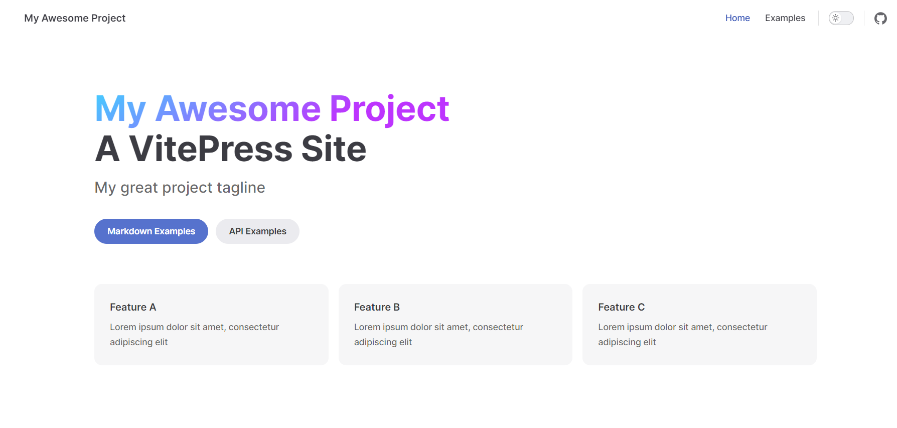
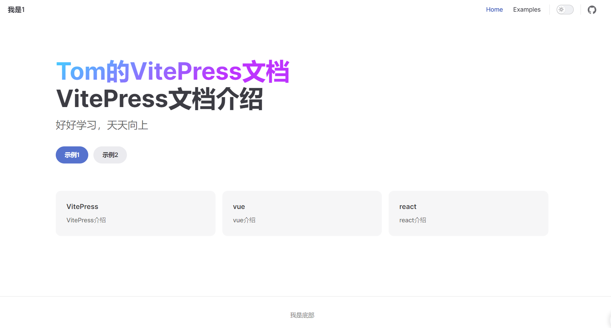

# 前言

VitePress 是一个基于 Vue.js 和 Vite 构建的静态网站生成器，专注于快速搭建文档和技术博客！

## 创建项目

**安装 vitepress**

首先新建文件夹，打开 cmd 窗口

```sh
pnpm add -D vitepress
```

**初始化 Vitepress**

```sh
pnpm vitepress init
```

这是我的配置，简单介绍一下

1. 第一个是在当前根目录下创建 vitepress 项目，通常我会叫 docs 用来包裹 vitepress 文件
2. 站点标题。后续可以在配置中改
3. 站点描述。后续可以在配置中改
4. 主题，建议选择第二个，个人觉得比较好看
5. 是否使用 ts，我们个人学习就没必要 ts 了，主要还是我懒
6. 是否添加脚本到 package.json，这个还是需要的，启动命令，打包命令这些都得用


初始化成功后，使用 vscode 打开文件夹，会看到这样一个目录。接下来简单介绍一下每个文件的含义

- .vitepress，最核心的目录
- theme 目录。自定义主题配置，css 样式等
- config.mjs。最核心的文件，各种配置导航栏、侧边栏、标题什么的都是在这里
- node_modules。安装的依赖
- api-examples.md 和 markdown-examples.md。官方给的两个示例
- index.md。主页相关
- package.json 和 pnpm-lock.yml。包管理工具需要用的


**启动项目**

```sh
pnpm run docs:dev
```

打开，看到这个，说明初始化成功



## 自定义

### 美化主页

对于主页，我们自定义的内容有哪些？如下图，9 个地方可以自定义。接下来就一一叙述这 9 个地方怎么自定义的。


1、7、8、9 这三个配置是在 config.mjs 中配置的

其中，title 对应 1，nav 对应 7，socialLinks 对应 8。description 是 SEO 要用的，我们不用关注。

```js
import { defineConfig } from 'vitepress';

// https://vitepress.dev/reference/site-config
export default defineConfig({
  title: '我是1', // 对应序号1
  description: 'A VitePress Site',
  themeConfig: {
    // https://vitepress.dev/reference/default-theme-config
    nav: [
      // 我是7
      { text: 'Home', link: '/' },
      { text: 'Examples', link: '/markdown-examples' },
    ],

    sidebar: [
      {
        text: 'Examples',
        items: [
          { text: 'Markdown Examples', link: '/markdown-examples' },
          { text: 'Runtime API Examples', link: '/api-examples' },
        ],
      },
    ],
    footer: {
      // 我是9
      copyright: '我是底部',
    },
    socialLinks: [
      // 我是8
      { icon: 'github', link: 'https://github.com/vuejs/vitepress' },
    ],
  },
});
```

2-6 是在 index.md 文件中自定义的。简单介绍一下对应关系

` name<==>2` ` text<==>3` `tagline<==>4 ` ` actions<==>5` `features<==>6`

需要说明的是，对于 5 这两个按钮，是可以跳转的，**link 指定路径**，比如/api-example 就是在项目根目录下找 api-example.md 这个文件

```js
---
# https://vitepress.dev/reference/default-theme-home-page
layout: home

hero:
  name: 'Tom的VitePress文档'
  text: 'VitePress文档介绍'
  tagline: 好好学习，天天向上
  actions:
    - theme: brand
      text: 示例1
      link: /markdown-examples
    - theme: alt
      text: 示例2
      link: /api-examples

features:
  - title: VitePress
    details: VitePress介绍
  - title: vue
    details: vue介绍
  - title: react
    details: react介绍
---

```

修改后的页面如下：


### 主页扩展

我们可能还想要对页面进行进一步美化，添加一些图标。可以去这个网站找图片<https://www.iconfont.cn/>

将找到的图片放在根目录下的 public 目录下。

```js
---
# https://vitepress.dev/reference/default-theme-home-page
layout: home

hero:
  name: 'Tom的VitePress文档'
  text: 'VitePress文档介绍'
  tagline: 好好学习，天天向上
  image:
    src: /logo.png
    alt: 背景图
  actions:
    - theme: brand
      text: 示例1
      link: /markdown-examples
    - theme: alt
      text: 示例2
      link: /api-examples

features:
  - title: VitePress
    details: VitePress介绍
  - title: vue
    details: vue介绍
  - title: react
    details: react介绍
---
```

最后美化的效果如图：


### icon 设置

美化地址栏 icon


在`config.mjs defineConfig`下面直接配置即可

```js
head:[['link',{rel:'icon',href:'fox.png'}]],
```

美化 title icon


在`index.md`下面直接配置即可

```js
hero:
  name: 'Tom的VitePress文档'
  text: 'VitePress文档介绍'
  tagline: 好好学习，天天向上
  image:
    src: /logo.png
    alt: 背景图
```

### 文章页扩展

当然，这样对一些项目的文档是非常合适的。但是如果我们需要记笔记的话有些繁琐，并且三边栏总感觉可以查阅的东西变少了。因此可以使用刚才说的自定义样式。将三边栏改成两边栏

在 config.mjs 中的 themeConfig 配置对象中配置

```js
sidebar: false, // 关闭所有的左侧侧边栏
aside: "left", // 设置右侧侧边栏在左侧显示
```

sidebar: false 是关闭全部的侧边栏，如果有的页面需要展示，有的不需要展示 需要这么做

```js
sidebar: {
      // 当用户在 `map` 目录页面下将会展示这个侧边栏，没有写就不会展示
      '/map/': [
        {
          text: 'JavaScript 基础知识',
          items: [
            // This shows `/guide/index.md` page.
            { text: 'Index', link: '/guide/' }, // /guide/index.md
            { text: 'One', link: '/guide/one' }, // /guide/one.md
            { text: 'Two', link: '/guide/two' } // /guide/two.md
          ]
        },
      ],
    },
```

### 创建路由

直接在 docs 里面创建和.vitepress 同级文件夹如'nav'在到里面创建 index.md 在里面编辑文档即可，如果需要导航跳转到'nav'文件夹

### 设置搜索框

在`config.mjs defineConfig themeConfig`下面直接配置即可

```js
   // 设置搜索框的样式
    search: {
      provider: "local",
      options: {
        translations: {
          button: {
            buttonText: "搜索文档",
            buttonAriaLabel: "搜索文档",
          },
          modal: {
            noResultsText: "无法找到相关结果",
            resetButtonTitle: "清除查询条件",
            footer: {
              selectText: "选择",
              navigateText: "切换",
            },
          },
        },
      },
    },
```
