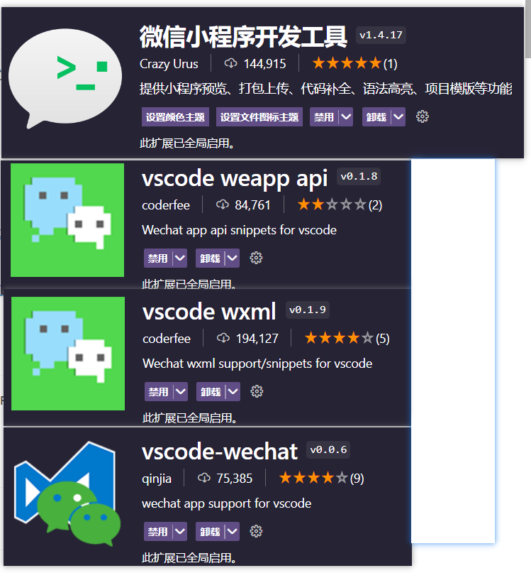
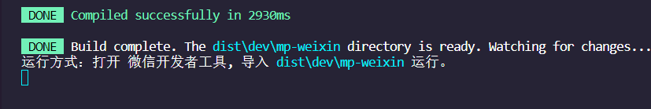
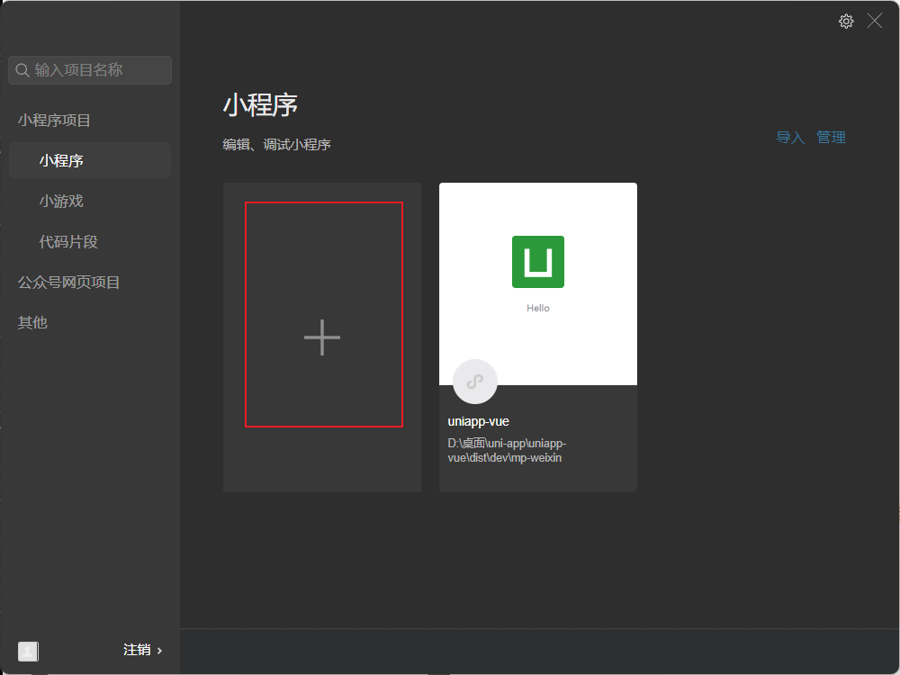
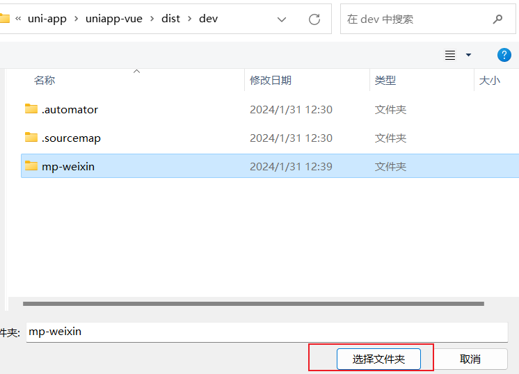
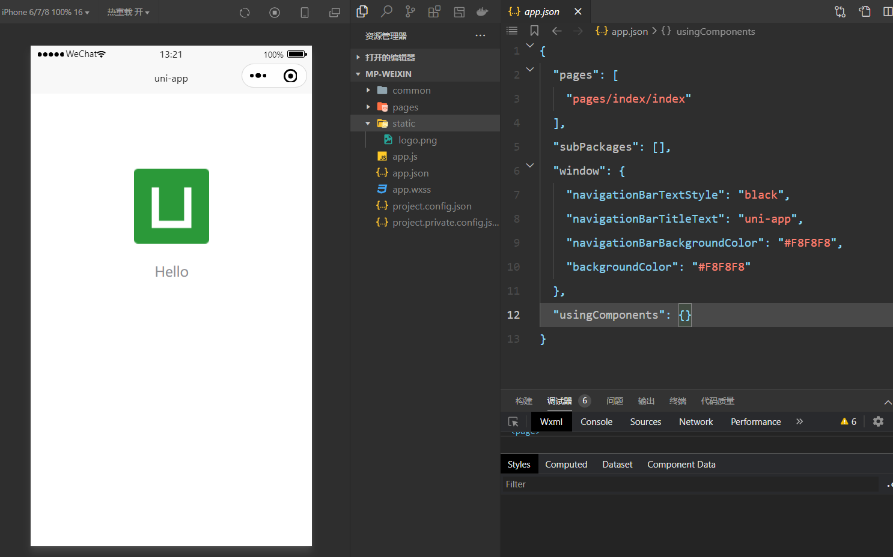
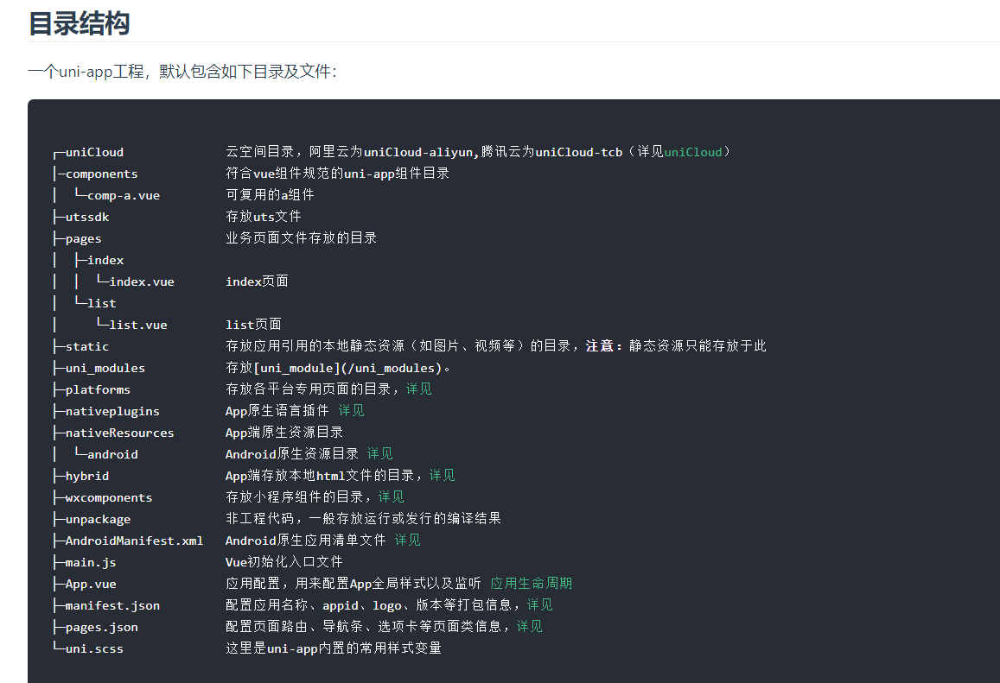

---
prev:
  text: 'React基础入门'
  link: '/note/React/'
next:
  text: 'TypeScript基础入门'
  link: '/note/TypeScript/'
---

# uni-app 入门笔记

**[uni-app](https://uniapp.dcloud.net.cn/)** 是一个使用 Vue.js 开发所有前端应用的框架，开发者编写一套代码，可发布到 iOS、Android、Web（响应式）、以及各种小程序（微信/支付宝/百度/头条/飞书/QQ/快手/钉钉/淘宝）、快应用等多个平台。

## uni-app 的优点

（1）跨平台开发，节省了开发成本和时间；

（2）基于 Vue.js 框架，易于上手和学习；

（3）插件化的架构，可以灵活地扩展功能；

（4）支持原生 API 调用，可以满足更多的需求；

（5）自带一套 UI 组件库，可以快速构建 UI 界面。

## 安装与运行

### 1.vscode 安装插件

**1.安装“微信小程序开发工具”，“vscode weapp api”，“vscode wxml”，“vscode-wechat”扩展**



### 2..在终端执行命令创建项目：

```sh
vue create -p dcloudio/uni-preset-vue uniapp-vue   //选择默认模版即可
```

这里的 uniapp-vue 是项目名称，不能大写

### 3.package.json 更改

```js
  // 改成
   "scripts": {
    "serve": "npm run dev:mp-weixin",
```

改成："serve": "npm run dev:mp-weixin"（目的：运行在微信开发者工具中）

如果不修改"serve": "npm run dev:h5"，那就可以直接运行（执行指令：npm run serve）在 h5 网页端出现 successfully 代表在网页端运行成功了

**更改之后执行 npm run serve**

运行成功后会生成 dist 文件夹 里面有个 mp-weixin 文件用于绑定微信开发者工具



### 4.微信开发者工具导入项目

**若没有这个应用，请先安装这个应用 [点击安装](https://developers.weixin.qq.com/miniprogram/dev/devtools/download.html)**



**找到项目下的 mp-weixin，选择文件夹，如果没有 appid 选择测试号就行**



**然后就运行成功了：**



运行如下，注意！！运行成功后在 vscode 别关闭项目，代码就在 vscode 里面写就行，写完保存代码，微信开发者工具也会自动更改

## uniapp 项目目录结构



提示

- `static`下目录的 js 文件不会被 webpack 编译，里面如果有 es6 的代码，不经过转换直接运行，在手机设备上会报错。
- 所以`less、scss`等资源同样不要放在 `static`目录下，建议这些公共的资源放在`common`目录下

**应用配置 manifest.json**

`manifest.json` 文件是应用的配置文件，用于指定应用的名称、图标、权限等，我们也可以在这里为 Vue 为 H5 设置跨域拦截处理器

**编译配置 vue.config.js**

`vue.config.js` 是一个可选的配置文件，如果项目的根目录中存在这个文件，那么它会被自动加载，一般用于配置 webpack 等编译选项。[官方文档](https://uniapp.dcloud.io/collocation/vue-config)

**全局配置 page.json**

`pages.json` 文件用来对 uni-app 进行全局配置，决定页面文件的路径、窗口样式、原生的导航栏、底部的原生 tabbar 等。它类似微信小程序中`app.json`的**页面管理**部分。[官方文档](https://uniapp.dcloud.io/collocation/pages)

**全局样式 uni.scss**

uni.scss 文件的用途是为了方便整体控制应用的风格。比如按钮颜色、边框风格，uni.scss 文件里预置了一批 scss 变量预置。官方文档

uni-app 官方扩展插件（uni ui）及 插件市场 上很多三方插件均使用了这些样式变量，如果你是插件开发者，建议你使用 scss 预处理，并在插件代码中直接使用这些变量（无需 import 这个文件），方便用户通过搭积木的方式开发整体风格一致的 App。

uni.scss 是一个特殊文件，在代码中无需 import 这个文件即可在 scss 代码中使用这里的样式变量。uni-app 的编译器在 webpack 配置中特殊处理了这个 uni.scss，使得每个 scss 文件都被注入这个 uni.scss，达到全局可用的效果。如果开发者想要 less、stylus 的全局使用，需要在 vue.config.js 中自行配置 webpack 策略。

## 生命周期

Uniapp 作为一款跨平台应用开发框架，具有丰富的生命周期，以下是 Uniapp 的生命周期：

**1.应用生命周期**

| 属性                 | 说明                                                          |
| -------------------- | ------------------------------------------------------------- |
| onLaunch             | 当 uni-app 初始化完成时触发（全局只触发一次）                 |
| onShow               | 当 uni-app 启动，或从后台进入前台显示（显示页面的时候触发）。 |
| onHide               | 当 uni-app 从前台进入后台（隐藏/退出页面的时候触发）          |
| onError              | 当 uni-app 报错时触发                                         |
| onThemeChange        | 监听系统主题变化                                              |
| onUniNViewMessage    | 对 nvue 页面发送的数据进行监听                                |
| onUnhandledRejection | 对未处理的 Promise 拒绝事件监听函数                           |
| onPageNotFound       | 页面不存在监听函数                                            |

**2.页面生命周期**

| **属性**                            | **说明**                                                                                         |
| ----------------------------------- | ------------------------------------------------------------------------------------------------ |
| onInit                              | 监听页面初始化，其参数同 onLoad 参数，触发时机早于 onLoad                                        |
| onLoad                              | 监听页面加载，其参数为上个页面传递的数据，参数类型为 Object（用于页面传参）                      |
| onShow                              | 监听页面显示。页面每次出现在屏幕上都触发，包括从下级页面点返回当前页面                           |
| onReady                             | 监听页面初次渲染完成。注意如果渲染速度快，会在页面进入动画完成前触发                             |
| onHide                              | 生命周期回调—监听页面隐藏                                                                        |
| onUnload                            | 生命周期回调—监听页面卸载                                                                        |
| onPullDownRefresh                   | 监听用户下拉动作，一般用于下拉刷新                                                               |
| onReachBottom                       | 页面滚动到底部的事件（不是 scroll-view 滚到底），常用于下拉下一页数据                            |
| onShareAppMessage                   | 用户点击右上角转发                                                                               |
| onShareTimeline                     | 用户点击右上角转发到朋友圈                                                                       |
| onAddToFavorites                    | 用户点击右上角收藏                                                                               |
| onPageScroll                        | 页面滚动触发事件的处理函数                                                                       |
| onResize                            | 页面尺寸改变时触发，详见 响应显示区域变化                                                        |
| onNavigationBarButtonTap            | 监听原生标题栏按钮点击事件，参数为 Object                                                        |
| onBackPress                         | 监听页面返回                                                                                     |
| onNavigationBarSearchInputChanged   | 监听原生标题栏搜索输入框输入内容变化事件                                                         |
| onNavigationBarSearchInputConfirmed | 监听原生标题栏搜索输入框搜索事件，用户点击软键盘上的“搜索”按钮时触发                             |
| onNavigationBarSearchInputClicked   | 监听原生标题栏搜索输入框点击事件（pages.json 中的 searchInput 配置 disabled 为 true 时才会触发） |

**3.组件生命周期**

跟 vue 的生命周期一样

| **属性**      | **说明**                                                                                                       |
| ------------- | -------------------------------------------------------------------------------------------------------------- |
| beforeCreate  | 在实例初始化之后被调用                                                                                         |
| created       | 在实例创建完成后被立即调用                                                                                     |
| beforeMount   | 在挂载开始之前被调用                                                                                           |
| mounted       | 挂载到实例上去之后调用                                                                                         |
| beforeUpdate  | 数据更新时调用                                                                                                 |
| updated       | 数据更新之后时调用                                                                                             |
| beforeDestroy | 实例销毁之前调用。在这一步，实例仍然完全可用                                                                   |
| destroyed     | Vue 实例销毁后调用。调用后，Vue 实例指示的所有东西都会解绑定，所有的事件监听器会被移除，所有的子实例也会被销毁 |

## 内置组件

官网写的太好了懒得整理了 [点击进入官网](https://uniapp.dcloud.net.cn/component/view.html)
